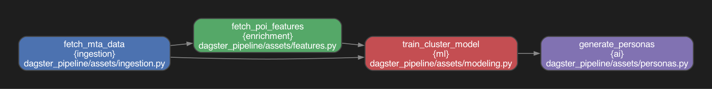

# Metropulse NYC: Urban Mobility Intelligence Platform

[](https://github.com/OrenSegal/metropulse-nyc/actions/workflows/ci.yml)

## System Overview

Metropulse segments NYC subway stations into behavioral archetypes by
synthesizing temporal ridership signals (MTA) with geospatial amenity
vectors (OpenStreetMap) into a "Station DNA" used to drive unsupervised
clustering and hybrid narrative generation.

Compute (Dagster/Polars, batch) is decoupled from serving (FastAPI/DuckDB,
query-time): the pipeline writes Parquet once, the API reads it directly
with zero-copy DuckDB scans — no persistent database process, no ETL into a
serving store.

On the current dataset: 660 stations, 5 behavioral clusters, 73,545
ridership rows. A `GROUP BY station` aggregation over the full ridership
table (the query the pulse endpoint runs on every cold start) executes in
~6ms — DuckDB-over-Parquet stays interactive at this scale without an index
or a warm cache.

## Architecture

### 1. Data Engineering Pipeline (ELT)

The pipeline is orchestrated via **Dagster** (`dagster_pipeline/`) as four
software-defined assets, each declaring its inputs as function parameters —
Dagster resolves the dependency graph from that, not from a separate config:



_(`scripts/render_asset_graph.py` regenerates this from the actual
`@asset` signatures in `dagster_pipeline/assets/*.py` — it's a transcription
of the real dependency graph, not a mockup.)_

- `fetch_mta_data` (ingestion) → `fetch_poi_features` (enrichment)
- both feed `train_cluster_model` (ml)
- which feeds `generate_personas` (ai)

The pipeline follows a functional data flow pattern:

- **Ingestion (Resilient Fetch):**
  - _Source:_ NY Open Data (Socrata API).
  - _Logic:_ Implements dynamic date-window detection to query the `max(transit_timestamp)` and fetch a rolling 30-day window. This handles upstream reporting lags gracefully.
- **Enrichment (Geospatial Vectorization):**
  - _Source:_ OpenStreetMap (Overpass API via OSMnx).
  - _Logic:_ Generates 300m isochrones around every station centroid to calculate feature vectors: `nightlife` (amenity=bar), `corporate` (office=\*), and `academic` (amenity=university).
- **Transformation (Time-Series Engineering):**
  - _Signal Processing:_ Ridership is pivoted from scalar rows to **168-dimensional vectors** (Hour-of-Week).
  - _Scaling:_ `TimeSeriesScalerMeanVariance` (Z-Score) is applied to normalize volume, ensuring clustering is based on _temporal shape_ (commuter patterns) rather than magnitude.

### 2. Logic Engines (Backend)

The FastAPI backend (`backend/app/main.py`) runs deterministic classification
and narrative generation before any LLM call, so the facts a station's
description depends on (borough, archetype, peak time) never depend on
model output.

- **GeoEngine (Linear Boundary Classification):**
  - Instead of a bounding box per borough, a piecewise slope-intercept model
    approximates the diagonal path of the East River, so Manhattan resolves
    correctly against Brooklyn/Queens near diagonal-boundary neighborhoods
    like DUMBO and Long Island City, where a bounding box misclassifies.
  - Covered by 10 unit tests in `backend/tests/test_geo_engine.py`, one per
    boundary zone.
- **NarrativeEngine (Hybrid Deterministic/Generative):**
  - _Layer 1 (Deterministic):_ A rule-based engine generates a "Base
    Narrative" from strict thresholds (e.g. `Social Pulse > 80` + `Night
    Traffic > 40` → "Nightlife District"). Borough and archetype in the
    response always come from this layer, never from the LLM.
  - _Layer 2 (Generative):_ Gemini is used only for stylistic polish, given
    Layer 1's output as a constraint, and is skipped entirely when no API
    key is configured — the endpoint still returns the deterministic
    narrative.
  - Covered by 9 unit tests in `backend/tests/test_narrative_engine.py`,
    one per archetype branch plus a priority-ordering check (high vitality
    alone doesn't trigger "Nightlife" without matching night-traffic too).

### 3. Serving Layer (OLAP)

- **Storage:** Columnar Parquet files (`backend/data/*.parquet`) serve as the System of Record.
- **Query Engine:** **DuckDB** runs in-process within the API, executing SQL directly over Parquet with zero-copy reads.
- **Context-Aware UI:** The frontend adapts its visualization strategy based on the analytical mode (General, Lifestyle, or Retail Scout).

## Metric Definitions

### Social Pulse ($S_p$)

_Previously "Vitality Score"._
A percentile rank quantifying the **"Off-Work" energy** of a neighborhood. It combines the density of social amenities (bars, restaurants, culture) with late-night ridership patterns.
$$ S*p = \text{Percentile}(Density*{amenities} \times Ridership\_{night}) $$

- **> 80:** High Energy / Nightlife Hub.
- **< 20:** Quiet / Residential Zone.

### Retail Gap ($R_g$)

Quantifies the imbalance between workforce density and local services.
$$ R_g = \text{Norm}(O_s) - \text{Norm}(S_p) $$

- **High Gap (> 0.6):** High concentration of office workers but low Social Pulse (amenities). Indicates a prime investment opportunity for retail or lunch spots.

### Time DNA

A vectorized representation of the station's "Pulse".

- **Morning Peak (6-10 AM):** Commuter Outflow (Residential) or Inflow (Commercial).
- **Night Peak (10 PM - 4 AM):** Indicator of specific nightlife destinations vs. 24h hubs.

## Setup & Deployment

### Prerequisites

- Python 3.10+
- Node.js 18+
- Google Gemini API Key (Optional, for narrative polish)

### Local Development

1.  **Install dependencies:**

    ```bash
    python -m venv venv && source venv/bin/activate
    pip install -r requirements.txt
    cd frontend && npm install && cd ..
    ```

2.  **Hydrate Data Lake:**

    ```bash
    # Runs the ETL pipeline to generate Parquet files
    # Note: Requires ~2GB RAM for OSMnx graph processing
    dagster asset materialize --select \* -m dagster_pipeline
    ```

3.  **Start Platform:**
    ```bash
    ./dev.sh
    ```
    - Backend: `http://localhost:8000`
    - Frontend: `http://localhost:5173`
    - Dagster UI: `http://localhost:3000`

### Docker

```bash
docker compose up --build
```

Builds and runs the backend (`:8000`) and frontend (`:5173`) as separate
containers. The backend mounts `backend/data` at runtime rather than baking
pipeline output into the image, so it always serves whatever `dagster asset
materialize` most recently produced. Run the pipeline hydration step above
first — an empty `backend/data` means the API responds with empty lists
instead of station data (see the "no data" branches in
`backend/app/main.py`'s loaders).

### Tests

```bash
cd backend
pip install -r requirements-dev.txt
python -m pytest tests/ -v
```

19 unit tests against the real `GeoEngine` and `RuleBasedNarrative` classes
in `app/main.py` — no mocking, and no data files required (both classes are
pure functions over their arguments). CI runs this suite on every push (see
the badge above).
