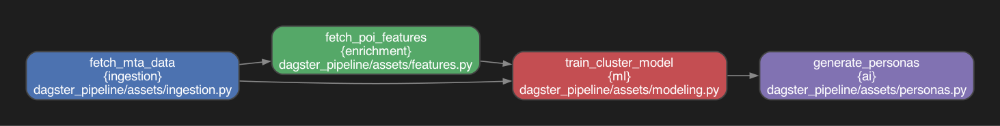

# Metropulse NYC

Groups New York City subway stations by how riders use them.

[](https://github.com/OrenSegal/metropulse-nyc/actions/workflows/ci.yml)

Metropulse combines hourly MTA ridership with counts of nearby bars, offices and universities from OpenStreetMap, then clusters stations with similar weekly ridership patterns. A FastAPI backend serves the clusters, per-station metrics and short text descriptions, and a React frontend shows them on a map.

## How it works

A Dagster pipeline (Polars, batch) writes Parquet files. The API reads those files directly with DuckDB at query time, so there is no database server to run and no step that loads data into a separate serving store.

### Pipeline

The pipeline in `dagster_pipeline/` has four Dagster assets. Each one declares its inputs as function parameters, and Dagster builds the dependency graph from those signatures:



_`scripts/render_asset_graph.py` regenerates this image from the `@asset` signatures in `dagster_pipeline/assets/*.py`, so it reflects the real graph._

- `fetch_mta_data` (ingestion) → `fetch_poi_features` (enrichment)
- both feed `train_cluster_model` (ml)
- which feeds `generate_personas` (ai)

What each stage does:

- **Ingestion.** Pulls ridership from NY Open Data (Socrata API). It first looks up the latest `transit_timestamp` and fetches the 30 days before it, so a lag in upstream reporting doesn't produce an empty window.
- **Enrichment.** Uses OSMnx (Overpass API) to count points of interest within 300m of each station: nightlife (`amenity` = bar, pub, nightclub), offices (any `office=*` tag) and academic (`amenity` = university, college).
- **Transformation.** Pivots each station's ridership into a 168-value vector, one per hour of the week. `TimeSeriesScalerMeanVariance` (z-score) then normalizes each vector, so stations cluster by the shape of their week (for example, a commuter pattern) rather than by total volume.

Outputs land in `dagster_pipeline/data/processed/`. The backend reads from `backend/data/`, so they have to be copied there (see Setup).

### Backend

`backend/app/main.py` works out a station's borough and archetype with plain rules before any LLM call. The facts in a description (borough, archetype, peak time) never come from model output.

- **GeoEngine** assigns boroughs. A single bounding box per borough gets the wrong answer near the diagonal East River, around DUMBO and Long Island City. Instead, a piecewise slope-intercept line approximates the river so Manhattan is separated correctly from Brooklyn and Queens. `backend/tests/test_geo_engine.py` has 10 unit tests, one per boundary zone.
- **RuleBasedNarrative** writes the description in two layers:
  - Layer 1 applies fixed thresholds to produce a base description (for example, Social Pulse above 75 and night traffic above 40 gives "Nightlife District"). Borough and archetype in the response always come from this layer.
  - Layer 2 sends Layer 1's output to Gemini for wording only. With no API key configured, this step is skipped and the endpoint returns the Layer 1 text.
  - `backend/tests/test_narrative_engine.py` has 9 unit tests: one per archetype branch, plus a check that high Social Pulse alone doesn't produce "Nightlife" without matching night traffic.

### Serving

- **Storage:** Parquet files in `backend/data/*.parquet` are the source of truth.
- **Queries:** DuckDB runs inside the API process and runs SQL straight against the Parquet files, without importing them first.
- **Frontend:** the map changes what it shows depending on the selected mode: General, Lifestyle or Retail Scout.

## Performance

A fresh 30-day pull from the MTA API on 2026-09-09 gave 344 stations, 5 clusters and 106,810 ridership rows. These numbers change with the rolling window, so treat them as representative.

The benchmark times the per-station, per-hour aggregation (`GROUP BY` station and hour) that `preload_data()` in `backend/app/main.py` runs over the full ridership table on every cold start to build the pulse cache. It ran 100 iterations after a warmup:

| Measurement | p50 | p95 |
|---|---|---|
| DuckDB execution only | 5.82ms | 6.83ms |
| Full `db.query()` path | 21.96ms | 24.44ms |

The full path adds a fresh in-memory connection, pandas NaN/inf cleanup and conversion to dicts. That second number is the one that limits latency seen by a client.

To reproduce, run `python scripts/benchmark.py`. It needs `backend/data/traffic_clean.parquet`, a pipeline output that isn't checked into git; the script's docstring explains how to create it. A second check, `backend/tests/test_performance.py`, uses synthetic data, so it runs in CI without the real dataset.

## Metric definitions

### Social Pulse ($S_p$)

_Previously "Vitality Score"._ A percentile rank for a neighborhood's after-work activity. The design formula combines social amenity density (bars, restaurants, culture) with late-night ridership:

$$ S_p = \text{Percentile}(Density_{amenities} \times Ridership_{night}) $$

- **> 80:** high energy, nightlife hub.
- **< 20:** quiet, residential.

In the current code, the value is the station's percentile rank on bar count alone (`calculate_percentile("bars", ...)`).

### Retail Gap ($R_g$)

Measures how far office density outpaces local services. Design formula:

$$ R_g = \text{Norm}(O_s) - \text{Norm}(S_p) $$

- **High gap (> 0.6):** many office workers but few amenities (low Social Pulse). A likely opening for retail or lunch spots.

The current code uses fixed tiers instead: 0.9 when the office percentile is above 60 and Social Pulse is below 40, 0.6 when office is above 40 and Social Pulse below 50, and 0.1 when Social Pulse is above 80.

### Time DNA

A short summary of a station's daily ridership shape (`time_dna` in the API):

- **Morning peak (6 to 10 AM):** commuters leaving (residential) or arriving (commercial).
- **Night peak (10 PM to 4 AM):** separates nightlife destinations from 24-hour hubs.

## Setup

### Prerequisites

- Python 3.10+ (CI and the Docker image use 3.11)
- Node.js 20.19+ (required by Vite 7; CI uses Node 22)
- Google Gemini API key (optional, only for the Layer 2 wording step)

### Local development

1. **Install dependencies:**

    ```bash
    python -m venv venv && source venv/bin/activate
    pip install -r requirements.txt
    cd frontend && npm install && cd ..
    ```

2. **Build the data:**

    ```bash
    # Runs the pipeline and writes Parquet files to dagster_pipeline/data/processed/
    # Note: OSMnx needs about 2GB of RAM
    dagster asset materialize --select \* -m dagster_pipeline
    ```

3. **Start the app:**

    ```bash
    ./dev.sh
    ```

    - Backend: `http://localhost:8000`
    - Frontend: `http://localhost:5173`

    `dev.sh` copies the pipeline output into `backend/data/` only when `backend/data/clusters.parquet` is missing. After re-running the pipeline, copy the files yourself:

    ```bash
    mkdir -p backend/data
    cp dagster_pipeline/data/processed/* backend/data/
    ```

    `dev.sh` does not start the Dagster UI. To browse the asset graph, run `dagster dev -m dagster_pipeline` in another terminal (it serves on `http://localhost:3000` by default).

### Docker

```bash
docker compose up --build
```

This runs the backend (`:8000`) and frontend (`:5173`) as separate containers. The backend mounts `backend/data` at runtime instead of baking pipeline output into the image, so it serves whatever is in that folder when it starts. Build the data and copy it into `backend/data/` first (steps 2 and 3 above). If `backend/data` is empty, the API returns empty lists instead of station data (see the `return []` branches in the loaders in `backend/app/main.py`).

### Tests

```bash
cd backend
pip install -r requirements-dev.txt
python -m pytest tests/ -v
```

There are 21 backend tests. Nineteen exercise the real `GeoEngine` and `RuleBasedNarrative` classes in `app/main.py`. They use no mocks and need no data files, because both classes are pure functions of their arguments. The other 2, in `test_performance.py`, build their own synthetic Parquet file and check that the `GROUP BY` station query stays under a generous time limit.

CI runs these tests on every push to `main` and on pull requests, along with `ruff` and the frontend's lint, test (`npm run test`) and build steps. See [CONTRIBUTING.md](CONTRIBUTING.md) for more setup detail.
